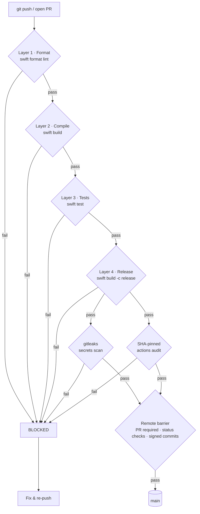

# Bantay-TUI — Agent Sentinel Notch HUD

[](https://github.com/8-BitRhyon/bantay-tui/actions/workflows/ci.yml)
[](LICENSE)

Native SwiftUI macOS app that turns the MacBook notch into an interactive agent-state display, reading lifecycle events directly from Herdr.

An agent is `working`, `blocked`, waiting for `approval`, or `done` — Bantay-TUI makes that visible without opening Notification Center: a floating pill under the notch, colored per state, with per-event sounds. **Hover the pill** to expand a live roster of every active agent (source, state, what it's doing) — click any row to jump straight to that agent's pane in herdr.

## Hover island

- The pill shows the most urgent agent state (`blocked` > `done` > `working`); a gray `Agents · N` pill appears when agents are idle.
- Hover (or click the idle pill) to expand a list of **all** active agents, refreshed every `captureInterval` seconds — each row: status dot, agent name, state label, terminal title.
- Click a row (or the pill) → `herdr pane focus <paneId>` jumps to that agent's pane.
- A menu bar icon lists the same agents with the same focus actions, plus Quit (the app is `.accessory` — no Dock icon).

## Approval prompts

When an agent is `blocked` (access-request), the pill renders inline controls that drive the agent's terminal via `herdr agent send-keys`:

- **Yes/No** (default): Approve (sends `y` + Enter) / Deny (sends `n` + Enter).
- **Choices** (`variance: "choices"` + `choices` array): numbered buttons that send the 1-based index + Enter.
- **Multi-select** (`variance: "multi"` + `choices` array): toggle buttons (green = selected) plus a Submit button that sends comma-joined indices (e.g. `1,3` + Enter).

All variants include a Focus button that jumps to the agent's pane.

## CI/CD Pipeline

Every change must pass five CI layers plus the remote merge barrier before it reaches `main`. Nothing merges — or pushes to `main` — without all gates green.



Source: [`docs/ci-pipeline.mmd`](docs/ci-pipeline.mmd)

### The layers

| Layer | Gate | Job | What fails it |
|---|---|---|---|
| 1 · Format | `swift format lint --recursive --strict Sources Tests` | `format` | Any style deviation (`.swift-format` pins the rules) |
| 2 · Compile | `swift build` | `build` | Compiler errors or warnings-as-failures on macOS |
| 3 · Tests | `swift test` | `test` | Any failing unit test (`BantayTUILogicTests`) |
| 4 · Release | `swift build -c release` | `release` | Release-mode build failure (optimization-only issues) |
| 5 · Security | gitleaks + SHA-pin audit | `secrets`, `pins` | Leaked secrets in history; unpinned third-party actions |

Layers 1–4 run sequentially (`needs:`), so a later layer only starts after the previous one is green. Layer 5 runs in parallel to 1–4 and fails the pipeline on any finding.

### The remote barrier

`main` is protected with branch protection rules:

- Pull requests are **required** — no direct pushes to `main`
- The `ci` workflow status checks are **required** before merge
- Commits must be **signed** (verified)

The checks are enforced for administrators too. CI failure at any layer blocks the merge; the fix must re-enter through the pipeline.

## Requirements

- macOS 14.6+
- Swift 6 toolchain (Xcode 16+ for `swift test` — XCTest is not available in CommandLineTools)
- Node.js 18+ (for the Herdr event adapter)

## Build & Run

```bash
swift build          # debug binary at .build/debug/bantay
./.build/debug/bantay
```

Run it once as a launch agent (auto-starts on login, keeps running):

```bash
sh scripts/setup.sh
```

`setup.sh` copies the binary to `~/Library/Application Support/Bantay-TUI/bantay` and installs the launch agent pointing there. Running the agent from the repo's `.build` directory is unreliable — launchd execution of a freshly rebuilt binary under `~/Downloads` can block in dyld's `open()` (Downloads provenance/TCC evaluation never completes for a launchd-spawned GUI process).

## Herdr Integration

Bantay-TUI captures herdr's live agent state directly — no plugin, wrapper, or in-herdr launch required. Agents herdr knows about (kilo, Freebuff, Command Code, …) show up in the notch regardless of how they were started.

- **Direct capture** (default): the app polls `herdr agent list` every `captureInterval` seconds and maps statuses to the pill: `blocked → access_request`, `working → progress`, `done → completed`. The highest-severity agent per name wins (`blocked` > `done` > `working`); a blocked/working pill that times out silently reappears while the agent is still active.
- **Event hook** (optional, for richer state labels): `herdr-plugin.toml` registers `scripts/event-adapter.mjs` on `pane.agent_status_changed`, appending JSONL to `agent-events.jsonl`, which the app also tails.

To install the optional event hook and the launch agent:

```bash
herdr plugin link /path/to/bantay-tui   # links herdr-plugin.toml; enabled by default
herdr server reload-config
sh scripts/setup.sh                     # idempotent; data dir + launch agent
```

- **Setup action** (`scripts/setup.sh`) creates `~/Library/Application Support/Bantay-TUI/` and installs the launch agent (`com.bantay-tui.agent`, `RunAtLoad` + `KeepAlive`).
- **Event hook** (`scripts/event-adapter.mjs`) subscribes to `pane.agent_status_changed`, maps Herdr statuses to Bantay event kinds, and appends JSONL to `agent-events.jsonl`:

```
~/Library/Application Support/Bantay-TUI/agent-events.jsonl
```

Status mapping: `blocked → access_request`, `working → progress`, `running → started`, `idle → waiting`, `done → completed`, `failed → failed`, `cancelled → cancelled`, `clear → clear`.

### Herdr event payload

Herdr delivers each event as JSON in `HERDR_PLUGIN_EVENT_JSON` (verified against herdr's bundled API schema, protocol 17):

```json
{"event":"pane_agent_status_changed","data":{"type":"pane_agent_status_changed","pane_id":"1-2","workspace_id":"1","agent_status":"blocked","display_agent":"claude","agent":"claude","title":"agent display name","state_labels":{"blocked":"Waiting for approval"}}}
```

| `data` field | Type | Used by the adapter |
|---|---|---|
| `agent_status` | string (required) | Mapped to event `type` (`idle`/`working`/`blocked`/`done`/`unknown`) |
| `pane_id` | string (required) | `paneId`; pill click runs `herdr pane focus <paneId>` |
| `workspace_id` | string (required) | `workspaceId` (reserved) |
| `display_agent` / `agent` | string? | `source` |
| `title` | string? | `title` |
| `state_labels` | object? | First label value becomes `message` |

### Event file format

Newline-delimited JSON, one event per line:

```json
{"source":"claude","type":"access_request","title":"agent display name","message":"Waiting for approval","paneId":"1-2","workspaceId":"1","variance":"yes-no","choices":null}
```

| Field | Type | Meaning |
|---|---|---|
| `source` | string | Agent/display name emitting the event |
| `type` | string | `access_request`, `waiting`, `completed`, `failed`, `started`, `progress`, `cancelled`, `clear` |
| `title` | string? | Display title for the pill |
| `message` | string? | State label text (`state_labels`), e.g. "Waiting for approval" |
| `paneId` | string? | Herdr pane id; pill click runs `herdr pane focus <paneId>` |
| `workspaceId` | string? | Workspace label (reserved) |
| `variance` | string? | Approval prompt type: `yes-no` (default), `choices`, `multi` |
| `choices` | [string]? | Option labels for `choices` / `multi` prompts |

The app tails the file — events written before launch are skipped, duplicate events for an active state are ignored, and a `clear` event dismisses the pill.

### Verify the integration

```bash
herdr plugin list                          # bantay-tui.integration: enabled
herdr plugin log list                      # event-adapter runs show exit_code 0
tail -f ~/Library/Application Support/Bantay-TUI/agent-events.jsonl
launchctl print gui/$(id -u)/com.bantay-tui.agent   # state = running
```

## Configuration

Stored in `UserDefaults` (domain `BantayTUI`):

| Key | Default | Meaning |
|---|---|---|
| `enableAgentAlerts` | `true` | Play sounds on new events |
| `soundVolume` | `0.35` | Alert volume |
| `autoClearTTL` | `3.0` | Seconds before a finished event auto-clears |
| `stickyApprovalTTL` | `30.0` | Seconds an approval request stays (sticky sources: `codex`, `cursor`, `freebuff`, `commandcode`) |
| `captureEnabled` | `true` | Poll herdr's live agent list |
| `captureInterval` | `2.0` | Seconds between `herdr agent list` polls |

## Architecture

See [ARCHITECTURE.md](ARCHITECTURE.md) for the component breakdown, event-source design (file adapter vs socket adapter), and integration points.

## Development

```bash
swift format format --in-place --recursive Sources Tests   # apply style
swift format lint --recursive --strict Sources Tests       # CI Layer 1
swift build                                                # CI Layer 2
swift test                                                 # CI Layer 3 (requires Xcode)
```

Unit tests live in `Tests/BantayTUILogicTests` and cover the event pipeline: launch offset, tailing, truncation recovery, partial lines, duplicate suppression, `clear` handling, and malformed-line tolerance.

## License

MIT — see [LICENSE](LICENSE).
