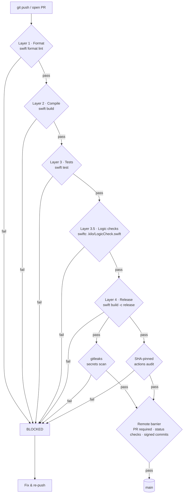

# Bantay-TUI — Agentic Control Plane in Your Notch

[](https://github.com/8-BitRhyon/bantay-tui/actions/workflows/ci.yml)
[](LICENSE)

Native SwiftUI macOS app that turns the MacBook notch into a **control plane for your AI coding agents** — supervise, steer, and approve agents from anywhere on the desktop, without switching to a terminal window. Research, marketing, or a meeting with stakeholders — Bantay keeps your agentic workflow glanceable and actionable.

Agents run inside herdr, tmux, zellij, or a plain terminal — Bantay detects them all. `working`, `blocked`, waiting for `approval`, or `done` — one glance at the notch tells you, and one click approves it.

## Highlights

- **Live idle strip beside the notch** — agent chips with severity dots (dot/name/summary styles), `+N` overflow, density pin; hover or tap expands.
- **Expanded control plane** — counts header ("N need you · M working"), a clean single-list roster with blocked agents handled **inline** (approve/deny/choice/submit right on the row), state-grouped by default, live "what is it doing" status, a Recent section showing what finished, and inline Focus / Stop / Peek actions.
- **Full approval execution in-UI** — yes/no, numbered choices, multi-select toggle+submit. Never open the terminal for a permission prompt.
- **Real-time by default** — a persistent herdr `events.subscribe` push stream drives the roster (sub-millisecond status transitions, no polling); the poll loop is a slow safety net.
- **Push notifications (ntfy.sh)** — approvals, failures, and completions pushed to your phone/other devices via a configurable topic.
- **tmux status-bar integration** — optional one-line agent summary (`◐ working · ⚠ blocked`) inside tmux `status-right`.
- **Universal agent detection** — herdr panes *plus* standalone Claude Code, Codex, Gemini, Cursor, and opencode processes (with latest-activity tailing from transcripts). No multiplexer required.
- **Live usage, cost & quota** — a real ledger adapter reads kilo's SQLite database (`kilo.db` — the source behind `kilo stats`): daily spend vs. your budget drives the quota badge + edge-glow, and a tokens-per-minute badge polls cumulative totals for a live rate. A scalable `UsageSample` provider protocol extends to Codex, Claude, opencode, and aider.
- **Drop files onto the notch** — drag a file/photo over the notch to expand it, open the Shelf, and land the file there. The shelf is a real NotchDrop-style surface: copies files into its own storage, persists across restarts, renders QuickLook thumbnails, has a retention policy, and glows on drop.
- **Apple Reminders in the task tab** — one-tap sync with the Reminders app (EventKit): quick-add, complete, remove, overdue highlight — plus a Barrie-style **natural-language quick-add** ("take out trash before end of day @home" → date, priority, tags, agent parsed live with a preview chip).
- **Workflow from anywhere** — global `⌥Space` to show/hide the island, `Y`/`N`/`1-9` roster shortcuts, edge-glow when agents need you, menu-bar badge with pending count, clipboard + file shelf, per-agent prompt composition.
- **Approvals answerable from everywhere** — the island, macOS Notification Center actions (Approve/Deny/choice), the menu-bar roster submenu, and global `⌥Y`/`⌥N` — and opencode panes are answered through a decision-file channel the opencode plugin polls.
- **Engineered for the hard cases** — approval heartbeat (no phantom prompts), full-screen & space transitions, menu-bar icon collision avoidance, display hot-swap re-anchoring, terminal-agnostic focus (Ghostty/Warp/WezTerm/Alacritty/iTerm2/VSCode).

## The island

### Idle

When agents are active and nothing urgent is pending, the notch shows a compact **agent strip** (beside the notch, left/right/center — your choice):

- **Names** (default): per-agent chips — severity dot + agent name, capped (default 3, up to 6) with `+N` overflow.
- **Dots**: severity dots only for a minimal glance.
- **Summary**: one dot + "N agents".

The strip yields to menu-bar icons: when `avoidMenuBarIcons` is on (default), the OS-reported auxiliary areas clamp the strip so it never overlaps Bartender/Ice status clusters.

### Expanded control plane

Hover (or `⌥Space`) to expand the island into a control plane:

- **Header** — "N need you · M working" counts + pin.
- **One list, no queue cards** — blocked agents render as normal roster rows with **inline** controls:
  - **Yes/No**: Approve / Deny.
  - **Choices**: numbered buttons (`1`/`2`/`3` → choice + Enter).
  - **Multi-select**: toggle buttons (green = selected) + Submit (`1,3` + Enter).
- **Roster** — grouped by state (need-input → working → done → failed → idle, toggleable to flat); each row shows status dot, agent, the current `title`/`message` (what it's doing right now), elapsed time, and hover actions: Focus, Stop (Ctrl-C), and an eye to open the live log + diff overlay.
- **Recent** — the last few completions/failures (source, what it was doing, when) so you can see what happened at a glance.
- **Shelf tab** — drop files (or onto the notch itself) or copy text; both land on the shelf with open/copy-back actions.
- **Tasks tab** — a Barrie-style task manager: natural-language quick-add with a live parse preview ("deploy by friday 5pm !! @work @claude" → date, priority, tags, agent), categorized Overdue/Today/Later/Completed sections, and optional **Apple Reminders sync** (EventKit) so your tasks are real Reminders you can edit from the notch.
- **Usage in the header** — a live spend badge (`$X / $budget`) that turns amber ≥70% / red ≥100% (driving the island edge-glow) and a tokens-per-minute badge, both fed by the kilo ledger.

## Reliability engineering

Bantay ships fixes for the five hard problems that plague notch apps:

1. **Phantom prompts** — an approval heartbeat re-verifies pinned prompts against live agent state every poll. If the agent actually moved on (dropped hook), the phantom self-clears; unknowns never phantom-clear.
2. **Full-screen & spaces** — the panel uses `fullScreenAuxiliary`/`canJoinAllSpaces`/top-level window level, and enter/exit full-screen + space-change transitions re-anchor it after a settle delay.
3. **Menu-bar collisions** — idle chips are clamped to the OS-reported auxiliary-area geometry.
4. **Display hot-swap / clamshell ghosts** — display-change and wake events debounce, detect visible windows off every screen, and re-anchor before the WindowServer race can strand a ghost.
5. **Terminal-agnostic focus** — a bundle-ID registry (Ghostty → Warp → WezTerm → Alacritty → iTerm2 → Terminal → VSCode → IntelliJ) activates whichever terminal is running, with a preferred-terminal setting.

## Agent detection

Sources feed the same event pipeline:

1. **herdr push stream** (default when present) — a persistent `events.subscribe`
   socket subscription drives status transitions instantly (`pane.updated`,
   `pane.agent_detected`, `pane.closed`); a slow `agent list` poll acts as a
   safety net. Statuses map `blocked → access_request`, `working → progress`,
   `done → completed`, etc.
2. **Standalone scan** (default on) — classifies running processes into canonical agents (claude/codex/gemini/cursor/opencode), skips herdr-managed processes, and tails each agent's newest transcript for a live activity line. Runs off the main actor so the UI never blocks.
3. **Event file / remote ingest** (optional) — tails `~/Library/Application Support/Bantay-TUI/agent-events.jsonl` for richer state labels, and a localhost listener (off by default) accepts POSTed event lines from remote agents over `ssh -R <port>:localhost:<port>`.

Claude Code hooks installed by Bantay cover `PermissionPrompt`/`PermissionRequest`, `Stop`/`StopFailure`, and `Notification` (matchers `agent_needs_input` / `agent_completed` / `permission_prompt` / `idle_prompt`) — approval and completion signals arrive natively without screen detection.

Approval prompts in the event stream carry an optional `variance` (`yes_no`/`choices`/`multi`) and `choices` array; nil variance defaults to yes/no.

## Quick actions

| Action | How |
|---|---|
| Show/hide island | `⌥Space` (global, from any app) |
| Approve / Deny / Choose | `Y` / `N` / `1-9` with the island focused |
| View live log + diff | Eye icon on an agent row |
| Drop a file onto the notch | Drag it over the island → shelf opens and accepts it |
| Compose a prompt | Click an agent row |
| Copy prompt/message | Right-click an approval card |
| Push to phone (ntfy) | Settings → Push notifications → set a topic |
| Show status inside tmux | Settings → tmux status bar → enable |
| Snooze alerts | Tray menu → Snooze… (15m / 1h / 4h / until restart) |
| Test alert sound | Settings → Play alert sound preview |

## Install

### Launch agent (recommended)

```bash
swift build -c release
bash scripts/setup.sh        # copies binary + installs launch agent (auto-start, keep-alive)
```

`setup.sh` installs to `~/Library/Application Support/Bantay-TUI/` **as a proper `.app` bundle** (so notifications + EventKit Reminders work), with a `com.bantay-tui.agent` launch agent that runs the bundled binary, and copies `scripts/bantay-status.sh` (tmux status-bar helper) + `scripts/bantay-opencode.js` (opencode plugin) beside it. Restart after a rebuild:

```bash
launchctl kickstart -k gui/$(id -u)/com.bantay-tui.agent
```

First-run prompts: **Notifications** (approval actions), and **Reminders** if you enable task sync. Both are optional and can be granted later in System Settings.

Uninstall:

```bash
bash scripts/setup.sh --uninstall
```

### Homebrew cask (once a release is tagged)

```bash
brew tap 8-BitRhyon/bantay-tui
brew install --cask bantay-tui
```

Package a release zip locally:

```bash
swift build -c release
bash scripts/setup.sh --package   # → dist/bantay-tui.zip (Bantay-TUI.app)
```

### Open-source distribution

This project is not distributed through the Mac App Store and does not require
Apple Developer secrets. Releases are source-first and may include a universal2
ad-hoc-signed zip from CI. macOS Gatekeeper can warn for an ad-hoc artifact;
users can right-click the app and choose **Open**, or build from source with
the commands above. Developer ID signing/notarization is optional, not a
project requirement.

### Requirements

- macOS 13+
- Swift 6 toolchain (Xcode 16+ for `swift test`)
- Optional: herdr, Node.js 18+ (event adapter)

## CI/CD pipeline

Seven jobs across five layers; `main` is protected (PRs required, status checks required, commits must be signed):



Source: [`docs/ci-pipeline.mmd`](docs/ci-pipeline.mmd)

| Layer | Gate | What fails it |
|---|---|---|
| 1 · Format | `swift format lint --recursive --strict Sources Tests` | Style deviation (`.swift-format`) |
| 2 · Compile | `swift build` | Compiler errors or warnings-as-failures |
| 3 · Tests | `swift test` | Failing unit test (`BantayTUILogicTests`) |
| 3.5 · Logic checks | `swiftc` + run `.kilo/LogicCheck.swift` | Any failing L1–L64 harness assertion (runs without XCTest) |
| 4 · Release | `swift build -c release` | Release-mode build failure |
| 5 · Security | gitleaks + SHA-pin audit | Leaked secrets; unpinned third-party actions |

## Configuration

Stored in `UserDefaults` (domain `BantayTUI`). Most settings live in **Settings…** (tray menu, `Cmd-,`).

| Key | Default | Meaning |
|---|---|---|
| `islandDockSide` | `center` | Idle strip placement: right / left / center |
| `idleStyle` | `names` | Idle strip style: `names` / `dots` / `summary` |
| `idleMaxChips` | `3` | Max agent chips before `+N` (1–6) |
| `expandedGroupByState` | `true` | Group roster by state (else flat) |
| `globalHotkeyEnabled` | `true` | `⌥Space` toggle from any app |
| `keyboardShortcuts` | `true` | `Y`/`N`/`1-9` roster shortcuts |
| `edgeGlowEnabled` | `true` | Pulsing amber border when agents need you |
| `showElapsedTime` | `true` | Elapsed timer on working agents |
| `menuBarBadge` | `true` | Amber dot + pending count in the tray |
| `showShelfTab` / `shelfLimit` | `true` / `20` | Shelf tab + history cap (1–50) |
| `shelfKeepDuration` | `1 Day` | Shelf retention: 1 Hour / 1 Day / 3 Days / 1 Week / Forever |
| `showTasksTab` | `true` | Task manager tab (Barrie-style) |
| `followMouseScreen` / `floatingPillOnNoNotch` | `true` / `true` | Multi-monitor placement + floating pill on external displays |
| `showInFullScreen` | `true` | Keep island visible over full-screen apps |
| `avoidMenuBarIcons` | `true` | Clamp idle strip to menu-bar clear space |
| `standaloneScanEnabled` | `true` | Detect agents outside any multiplexer |
| `usageTrackingEnabled` | `true` | Read agent ledgers (kilo SQLite) for spend/tpm |
| `dailyBudgetUSD` / `enableSpendGlow` | `10.0` / `true` | Daily spend budget + edge-glow on ratio |
| `showTokenRate` | `true` | Tokens-per-minute badge in the header |
| `soundThemePreset` | `Sleek Modern` | Sound theme (approval/completion/error/working) |
| `ntfyTopic` / `ntfyServer` | `""` / `https://ntfy.sh` | Push notifications for approvals/failures/completions (empty = off) |
| `tmuxStatusEnabled` | `false` | Add `#(bantay-status)` to tmux `status-right` |
| `ingestEnabled` / `ingestPort` | `false` / `41817` | Remote event ingest over SSH (off by default) |
| `preferredTerminalBundleID` | nil | Terminal for Force Focus (nil = auto) |
| `captureEnabled` / `captureInterval` | `true` / `2.0` | herdr push stream + safety-net poll |
| `enableAgentAlerts` / `soundVolume` | `true` / `0.35` | Event sounds + volume |
| `autoClearTTL` / `stickyApprovalTTL` | `3.0` / `30.0` | Event auto-clear / sticky approval TTLs |
| `snoozedUntil` / `snoozeUntilRestart` | nil / `false` | Snooze state |

## Architecture

See [ARCHITECTURE.md](ARCHITECTURE.md) for the component breakdown, the three-source event pipeline, the `PlexerAdapter` seam, and the reliability systems.

## Development

```bash
swift format format --in-place --recursive Sources Tests   # apply style
swift format lint --recursive --strict Sources Tests       # CI Layer 1
swift build                                                # CI Layer 2
swift test                                                 # CI Layer 3 (requires Xcode)
swiftc -o /tmp/logic-check <harness sources> && /tmp/logic-check   # CI Layer 3.5
```

The `.kilo/LogicCheck.swift` harness (L1–L64) runs without XCTest and is the primary local gate: idle-strip geometry, expanded control-plane metrics, approval controls, heartbeat/phantom protection, screen selection, menu-bar clearance, usage parsing, ingest parsing, shelf logic, terminal registry, and facet persistence. Unit tests live in `Tests/BantayTUILogicTests`.

## License

MIT — see [LICENSE](LICENSE).

## Changelog

See [CHANGELOG.md](CHANGELOG.md).
