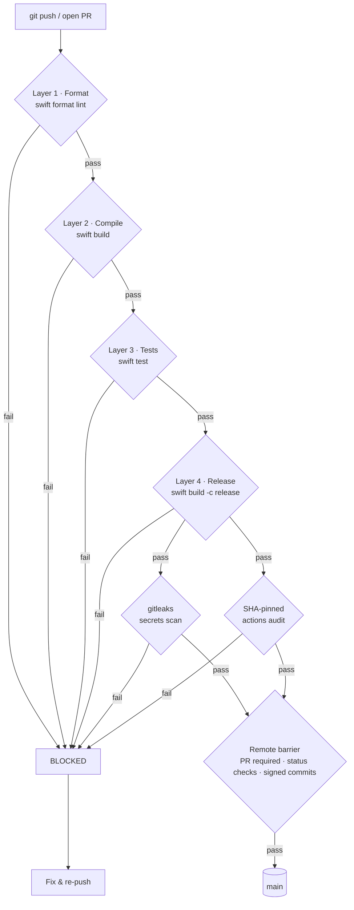

# Bantay-TUI — Agent Sentinel Notch HUD

[](https://github.com/8-BitRhyon/bantay-tui/actions/workflows/ci.yml)
[](LICENSE)

Native SwiftUI macOS app that turns the MacBook notch into an interactive agent-state display, reading lifecycle events directly from Herdr.

An agent is `working`, `blocked`, waiting for `approval`, or `done` — Bantay-TUI makes that visible without opening Notification Center: a floating pill under the notch, colored per state, clickable to focus the pane, with per-event sounds.

## CI/CD Pipeline

Every change must pass five CI layers plus the remote merge barrier before it reaches `main`. Nothing merges — or pushes to `main` — without all gates green.



Source: [`docs/ci-pipeline.mmd`](docs/ci-pipeline.mmd)

### The layers

| Layer | Gate | Job | What fails it |
|---|---|---|---|
| 1 · Format | `swift format lint --recursive --strict Sources Tests` | `format` | Any style deviation (`.swift-format` pins the rules) |
| 2 · Compile | `swift build` | `build` | Compiler errors or warnings-as-failures on macOS |
| 3 · Tests | `swift test` | `test` | Any failing unit test (`BantayTUILogicTests`) |
| 4 · Release | `swift build -c release` | `release` | Release-mode build failure (optimization-only issues) |
| 5 · Security | gitleaks + SHA-pin audit | `secrets`, `pins` | Leaked secrets in history; unpinned third-party actions |

Layers 1–4 run sequentially (`needs:`), so a later layer only starts after the previous one is green. Layer 5 runs in parallel to 1–4 and fails the pipeline on any finding.

### The remote barrier

`main` is protected with branch protection rules:

- Pull requests are **required** — no direct pushes to `main`
- The `ci` workflow status checks are **required** before merge
- Commits must be **signed** (verified)

The checks are enforced for administrators too. CI failure at any layer blocks the merge; the fix must re-enter through the pipeline.

## Requirements

- macOS 14.6+
- Swift 6 toolchain (Xcode 16+ for `swift test` — XCTest is not available in CommandLineTools)
- Node.js 18+ (for the Herdr event adapter)

## Build & Run

```bash
swift build          # debug binary at .build/debug/bantay
./.build/debug/bantay
```

Run it once as a launch agent (auto-starts on login, keeps running):

```bash
sh scripts/setup.sh
```

## Herdr Integration

`herdr-plugin.toml` registers the plugin with Herdr:

- **Setup action** (`scripts/setup.sh`) creates `~/Library/Application Support/Bantay-TUI/` and installs the launch agent.
- **Event hook** (`scripts/event-adapter.mjs`) subscribes to `pane.agent_status_changed`, maps Herdr statuses to Bantay event kinds, and appends JSONL to `agent-events.jsonl`:

```
~/Library/Application Support/Bantay-TUI/agent-events.jsonl
```

Status mapping: `blocked → access_request`, `working → progress`, `running → started`, `idle → waiting`, `done → completed`, `failed → failed`, `cancelled → cancelled`, `clear → clear`.

### Event file format

Newline-delimited JSON, one event per line:

```json
{"source":"codex","type":"progress","title":"agent display name","message":"custom status","paneId":"pane-123","workspaceId":"ws-1"}
```

| Field | Type | Meaning |
|---|---|---|
| `source` | string | Agent/display name emitting the event |
| `type` | string | `access_request`, `waiting`, `completed`, `failed`, `started`, `progress`, `cancelled`, `clear` |
| `title` | string? | Display title for the pill |
| `message` | string? | Custom status text |
| `paneId` | string? | Herdr pane id; pill click runs `herdr pane focus <paneId>` |
| `workspaceId` | string? | Workspace label (reserved) |

The app tails the file — events written before launch are skipped, duplicate events for an active state are ignored, and a `clear` event dismisses the pill.

## Configuration

Stored in `UserDefaults` (domain `BantayTUI`):

| Key | Default | Meaning |
|---|---|---|
| `enableAgentAlerts` | `true` | Play sounds on new events |
| `soundVolume` | `0.35` | Alert volume |
| `autoClearTTL` | `3.0` | Seconds before a finished event auto-clears |
| `stickyApprovalTTL` | `30.0` | Seconds an approval request stays (sticky sources: `codex`, `cursor`, `freebuff`, `commandcode`) |

## Architecture

See [ARCHITECTURE.md](ARCHITECTURE.md) for the component breakdown, event-source design (file adapter vs socket adapter), and integration points.

## Development

```bash
swift format format --in-place --recursive Sources Tests   # apply style
swift format lint --recursive --strict Sources Tests       # CI Layer 1
swift build                                                # CI Layer 2
swift test                                                 # CI Layer 3 (requires Xcode)
```

Unit tests live in `Tests/BantayTUILogicTests` and cover the event pipeline: launch offset, tailing, truncation recovery, partial lines, duplicate suppression, `clear` handling, and malformed-line tolerance.

## License

MIT — see [LICENSE](LICENSE).
