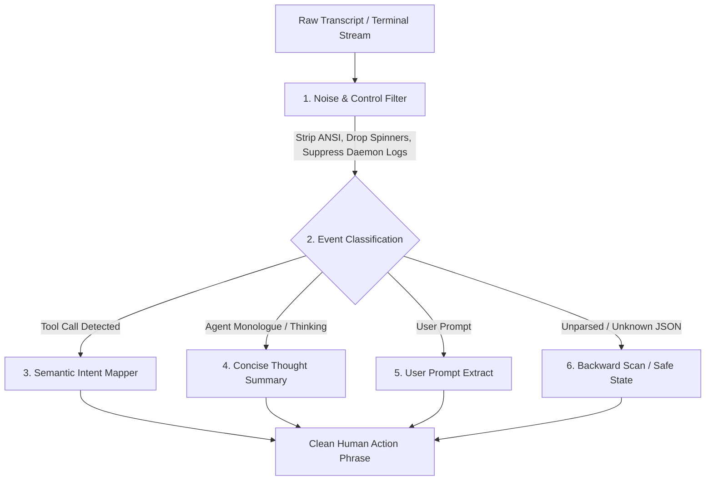

# Research: Agent Activity Detection & Text Sanitization in Bantay-TUI

**Date:** October 1, 2026  
**Status:** Completed Research & Feasibility Evaluation  
**Subject:** Eliminating Unintelligible Plain Text / Random Characters and Achieving Semantic Activity Detection

---

## 1. Executive Summary

When running AI coding agents (Antigravity/Gemini CLI, Claude Code, Goose, OpenCode/Kilo, Cursor, etc.), users frequently observe **unintelligible text strings, raw JSON fragments, terminal escape sequences (`^[[32m`), progress spinner braille characters (`⠋`, `⠙`), and machine hostnames (`MacBook.local`)** in the Bantay-TUI Dynamic Island and Notch HUD.

The user asked:
> *"The very next thing that I want to focus on is the actual detection of like what's going on, right? So here we can see, you know, Bantay TUI sometimes it just shows like plain text, some random characters, that is not legible, it's unintelligible to a user. So, I'm not sure if it's something that we can actually detect. So please do research on that first and then present me your findings."*

### Key Conclusion:
**Yes, we can 100% detect what is going on.**
The illegible output is not an unavoidable quirk of agent monitoring—it is caused by five specific architectural gaps in how text is extracted, parsed, sanitized, and displayed. By implementing semantic tool-call mapping and a strict sanitization pipeline, Bantay-TUI can reliably display clean, human-readable action phrases (e.g., *"Editing NotchStatusView.swift"*, *"Running test harness"*, *"Searching for HUD tokens"*) with zero garbage characters.

---

## 2. Root Cause Analysis: Where Do the Random Characters Come From?

Our codebase inspection and live system transcript analysis identified **five distinct leakage points**:

### Root Cause 1: Raw JSON Fallback Leaks
- **Location:** `Sources/BantayTUI/AgentDetector.swift:716-718`
  ```swift
  let snippet = line.trimmingCharacters(in: .whitespacesAndNewlines)
  if snippet.isEmpty { return nil }
  if snippet.hasPrefix("{") {
      return String(snippet.prefix(160)) // <-- Direct JSON leak!
  }
  ```
- **Mechanism:** When a transcript line is in JSON format but fails strict schema matching (or is sliced as a partial JSON chunk when reading the tail buffer), `AgentDetector` falls back to returning the raw JSON string up to 160 characters.
- **What the user sees:**
  `{"type":"file_history_snapshot","snapshot":{"files":[{"path":"/Users/rhyon/...`  
  or `{"session_id":"abc-123","event_type":"heartbeat"...`

### Root Cause 2: ANSI Escapes and Control Characters Bypass `cleanHUDText`
- **Location:** `Sources/BantayTUI/IslandMetrics.swift:554-613`
- **Mechanism:** `cleanHUDText` strips markdown links, paths, and log envelopes, but **does not strip ANSI escape sequences or C0/C1 control characters**.
  While a helper method `LogFormatter.stripControlCharacters` exists at line 1082 of `IslandMetrics.swift`, it is only used for the Peek Panel scrollback, **never** in `cleanHUDText`!
- **What the user sees:**
  - Raw color/style escapes: `^[[38;5;244mThinking...^[[0m` or `\033[?25h`
  - Cursor repositioning sequences: `^[[2K^[[1G`
  - Overwritten carriage return progress noise: `⠋ Thinking...\r⠙ Thinking...`
  - Terminal bells and null characters.

### Root Cause 3: Internal Engine, Daemon & Error Chatter
- **Location:** `Sources/BantayTUI/AgentDetector.swift:659-676` and `AgentDetector.swift:540-554`
- **Mechanism:** The skip list in `AgentDetector.swift` filters `CHECKPOINT`, `EPHEMERAL_MESSAGE`, `TASK_STATE`, and `VIEW_FILE`, but **misses**:
  - `ERROR_MESSAGE` (e.g. `Error: request failed: Post "https://daily-cloudcode-pa.googleapis.com...`)
  - `CODE_ACTION` diff blocks (e.g. `@@ -7238,6 +7238,7 @@ + print("DEBUG...")`)
  - `GREP_SEARCH` output dumps
  - Kilo/OpenCode daemon background logs (`INFO ... service=marketplace count=329 errors=0`)
  - Prune logs (`timestamp=... level=INFO message=cleanup prune=7.days`)
- **What the user sees:**
  Cryptic API endpoints, internal timestamps, stack traces, diff chunks, and maintenance messages.

### Root Cause 4: Shell Hostnames & Process Basenames as Fallbacks
- **Location:** `HerdrSocketAdapter.swift:328`, `TmuxAdapter.swift`, `ZellijAdapter.swift:134`
- **Mechanism:** When an agent runs in a multiplexer pane without an active transcript parser, Bantay falls back to the pane's terminal title. In macOS, terminal titles default to:
  - Hostnames: `MacBook.local`
  - Shell names: `zsh`, `bash`, `fish`
  - Process paths: `node /usr/local/bin/claude --resume-session-id 8923489123`
- **What the user sees:**
  The HUD displays `claude — MacBook.local` or `gemini — zsh`, which gives no indication of what the agent is actually working on.

### Root Cause 5: Display-Site Sanitation Gaps
- **Location:** `Sources/BantayTUI/NotchStatusView.swift` (lines 943, 1164, 1298) and `DynamicIslandApp.swift` (lines 608, 655).
- **Mechanism:** Several views render `event.title ?? event.kind.label` or `agent.title` directly into SwiftUI `Text(...)` or `NSMenuItem` **without passing through `cleanHUDText`**. Any uncleaned text immediately surfaces in the UI.

---

## 3. Can We Actually Detect What's Going On?

### **Yes. Modern AI Coding Agents are Highly Deterministic in Their Action Schemas.**

Regardless of whether the agent is Antigravity, Claude Code, Codex, Goose, OpenCode, Cursor, Roo, Cline, or Aider, **agents spend their active cycles executing a known, finite set of operations**:



### Action Category Mapping Matrix

| Raw Event / Tool Name | Sample Raw Payload | Desired Human-Intelligible Display |
| :--- | :--- | :--- |
| **File Edit**<br>`replace_file_content`<br>`write_to_file`<br>`edit_file`<br>`StrReplaceEdit` | `{"name":"replace_file_content","args":{"TargetFile":".../NotchStatusView.swift"}}` | **`Editing NotchStatusView.swift`** |
| **File Read**<br>`view_file`<br>`read_file`<br>`open` | `{"name":"view_file","args":{"AbsolutePath":".../AgentDetector.swift"}}` | **`Viewing AgentDetector.swift`** |
| **Test Execution**<br>`run_command`<br>`bash` | `{"command":"swift test --filter QuotaTests"}` or `cargo test`, `pytest`, `npm test` | **`Running tests`** |
| **Git Operations**<br>`run_command`<br>`bash` | `{"command":"git commit -m 'feat: revamp notch'"}` or `git push`, `git status` | **`Committing changes`** / **`Pushing to git`** |
| **Build Operations**<br>`run_command`<br>`bash` | `{"command":"swift build -c release"}` or `npm run build`, `cargo build` | **`Building release bundle`** |
| **Code Search**<br>`grep_search`<br>`search_web`<br>`glob` | `{"name":"grep_search","args":{"Query":"cleanHUDText"}}` | **`Searching for 'cleanHUDText'`** |
| **Directory Inspection**<br>`list_dir`<br>`ls` | `{"name":"list_dir","args":{"DirectoryPath":"/Sources/BantayTUI"}}` | **`Browsing BantayTUI/`** |
| **User Interaction**<br>`ask_question`<br>`approval` | `{"name":"ask_question","args":{"question":"Should we proceed?"}}` | **`Waiting for input: Should we proceed?`** |
| **Reasoning / Monologue**<br>`thinking`<br>`<thinking>` | `"Thinking through the edge cases of ANSI stripping in unicode..."` | **`Planning next step...`** |

---

## 4. Proposed Solution Architecture

We recommend a **3-Layer Detection & Sanitization Architecture**:

### Layer 1: Enhanced Semantic Activity Detection (`AgentDetector.swift`)
1. **Universal Tool-Call Extractor**:
   - Support Antigravity/Gemini (`tool_calls`), Claude Code (`tool_use`), Goose (`event.action`), and OpenCode/Codex RPC.
   - Intelligently map commands (e.g. `swift test` $\rightarrow$ `Running tests`, `git` $\rightarrow$ `Git operation`).
2. **Eliminate Raw JSON Leaks**:
   - Delete `if snippet.hasPrefix("{") { return String(snippet.prefix(160)) }`.
   - If a line starts with `{` and is not a known semantic payload, **drop it** and continue scanning backward in the transcript to find the last true action.
3. **Comprehensive Skip List**:
   - Filter out `ERROR_MESSAGE`, `SYSTEM_MESSAGE`, `CONVERSATION_HISTORY`, `KNOWLEDGE_ARTIFACTS`, diff blocks (`[diff_block_start]`, `@@`), compiler traces (`::error::`), and daemon maintenance pings.

### Layer 2: Universal Sanitization Engine (`IslandMetrics.cleanHUDText`)
1. **Full ANSI / CSI / OSC Escape Removal**:
   - Directly invoke ANSI stripping in `cleanHUDText`:
     - CSI: `\u{1b}\[[0-9;?]*[a-zA-Z]`
     - OSC: `\u{1b}\][^\u{07}\u{1b}]*(\u{07}|\u{1b}\\)`
     - Bare 2-character escapes (`\u{1b}[a-zA-Z]`)
2. **Terminal Spinner & Braille Filter**:
   - Strip dynamic spinner characters (`⠋`, `⠙`, `⠹`, `⠸`, `⠼`, `⠴`, `⠦`, `⠧`, `⠇`, `⠏`).
3. **Noise & Metadata Purging**:
   - Strip timestamps (`2026-10-01T...`), ISO dates, log levels (`INFO`, `WARN`, `ERROR`), and run IDs (`run_id=...`).
4. **Shell/Hostname Neutralization**:
   - If the resulting string is just a hostname (`MacBook.local`), shell (`zsh`, `bash`), or generic path, replace it with a clean status like `"Working on task"` or `"Active"`.

### Layer 3: Display-Site Defense in Depth (`NotchStatusView.swift` & `DynamicIslandApp.swift`)
1. Ensure all `Text(...)` and `NSMenuItem` allocations wrapping `event.title` or `agent.title` route through `cleanHUDText(...)`.
2. Provide a graceful semantic fallback (e.g. `agent.kind.label` like `"Working"`, `"Needs You"`, `"Done"`) whenever text is empty or silenced by the sanitizer.

---

## 5. Verification & Testing Strategy

To guarantee that no regressions occur:
1. **Unit Tests in `IslandMetricsTests.swift`**:
   - Test stripping of CSI 24-bit color escapes, DEC private modes (`?25h`), OSC titles, braille spinners, diff chunks, and daemon logs.
2. **Detection Tests in `QuotaTrackerTests.swift` / `AgentEventManagerTests.swift`**:
   - Feed raw transcript samples from real sessions (Antigravity, Claude Code, Kilo/OpenCode) and assert that every parsed title is a clean, readable action phrase without braces or control codes.
3. **Harness & Compiler Validation**:
   - Run `scripts/build-logic-harness.sh` to ensure all 149 verification layers pass.
   - Run `swift test` and `swift-format`.
