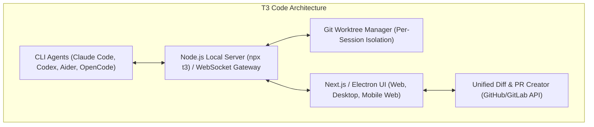
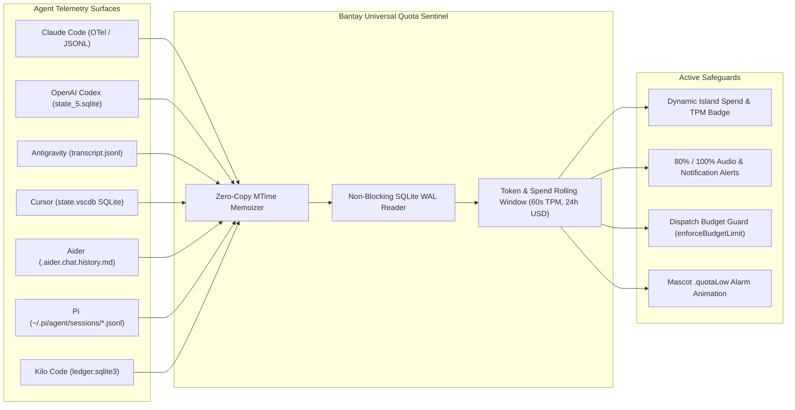

# Bantay-TUI — Comprehensive Research Dossier & Strategic Blueprint

> **Date:** September 2026  
> **Status:** Authoritative Reference Document  
> **Scope:** Competitor Analysis (T3 Code, Herdr, Firstmate, Backpass), Universal Coding Agent Quota Detection, UX/Interaction Engineering, and Autonomous "On-The-Go" Pipeline Architecture.

---

## Executive Summary: The Autonomous "On-The-Go" Paradigm

Modern AI-assisted development is fundamentally bifurcating into two operational modes:
1. **Synchronous In-Editor Pairing**: The developer sits in front of Cursor, Antigravity, or VS Code, generating lines or blocks in real time.
2. **Asynchronous Autonomous Delegation ("On-The-Go")**: The developer is away from the keyboard (running, commuting, walking), forms a high-level technical concept, delegates it via voice or phone, and returns to find a completed research spike, isolated branch, or pull request waiting for review.

**Bantay-TUI** occupies the most strategic position in this landscape. While competitors build heavy, full-screen Electron dashboards or web browser control surfaces, Bantay-TUI is a **hyper-lightweight native Swift macOS Dynamic Island HUD + Background Control Plane** (~136 MB RSS, 0% CPU idle).

By bridging **Apple Reminders (iCloud + Siri on iPhone/Watch)** to **local multiplexers (`herdr`, tmux)**, **isolated Git worktrees (`firstmate` pattern)**, and **continuous text-gradient memory (`backpass` pattern)**, Bantay becomes the personal autonomous engineering daemon that works while you are away.

---

## 1. Competitor & Peer Intelligence

### 1.1 T3 Code (`pingdotgg/t3code`)

Created by Theo Browne (ping.gg), **T3 Code** is an open-source, self-hosted web/desktop control surface designed to bridge command-line coding agents to a graphical interface.



#### Core Strengths of T3 Code:
1. **BYOK / BYOS (Bring-Your-Own-Key / Subscription)**: It does not sell tokens or proxy models; it hooks into CLI tools already authenticated on your machine.
2. **Automated Git Worktree Isolation**: Every task or session automatically spawns an ephemeral Git worktree (`git worktree add .worktrees/session-xyz branch-xyz`). The user’s main working directory and open IDE tabs are never polluted by incomplete agent experiments.
3. **Multi-Surface Access**: Because the server exposes a WebSocket gateway, developers can open the T3 Code web interface on an iPad or mobile browser on the local network.
4. **Unified Diff & PR Flow**: Offers a visual three-way diff (unstaged, turn-by-turn, branch-wide) and one-click GitHub PR creation.
5. **Supervised Steering**: Supports pausing or steering agent execution mid-turn.

#### Critical Weaknesses of T3 Code:
- **Electron / Node Server Bloat**: Requires running a Node background process or heavy Electron wrapper; memory consumption frequently exceeds 600MB–1.2GB RSS.
- **Window Management Friction**: It is another massive window competing for screen real estate alongside your IDE, terminal, and browser.
- **No Native macOS Hardware Integration**: Lacks Dynamic Island/Notch physical anchoring, Apple EventKit synchronization, or native AppKit global hotkeys.
- **Mobile Clunkiness**: Web app on mobile requires local network port-forwarding, Tailscale setup, or public ngrok tunneling, whereas Apple Reminders syncs seamlessly via native iCloud without open ports.

---

### 1.2 Kun Chen’s Agentic Suite (`herdr`, `firstmate`, `backpass`)

Kun Chen’s tools represent the state of the art in high-performance CLI-native agent multiplexing.

#### A. Herdr (`/opt/homebrew/bin/herdr`):
- **Protocol 19 Socket API**: Exposes a rich Unix Domain Socket IPC interface (`~/.config/herdr/herdr.sock`).
- **Core Methods**:
  - `worktree.create`, `worktree.list`, `worktree.open`, `worktree.remove`
  - `agent.start`, `agent.prompt`, `agent.read`, `agent.wait`, `agent.send_keys`, `agent.explain`
  - `pane.split`, `pane.send_text`, `pane.wait_for_output`
- **Agent Lifecycle States**: Distinctly classifies `idle`, `working`, `blocked` (access request/approval), `done`, and `unknown`.
- **Atomic Keystroke & Approval Injection**: `agent.send_keys` validates keys before writing, avoiding race conditions.

#### B. Firstmate:
- **Ephemeral Worktree Discipline**: Automatically branches off `main`, provisions a clean worktree in a scratch directory, launches the agent inside the worktree, and tracks modified files.
- **Task Contract**: Uses structured JSON specifications (`Goal`, `Files`, `Constraints`).

#### C. Backpass:
- **Philosophy**: *"You don't write AGENTS.md. You train it with gradient descent."*
- **Text Gradient Engine**: Analyzes session histories across agents to identify points where human users intervened to correct an agent (e.g., *"Don't run swift test directly, use scripts/build-logic-harness.sh"*).
- **2-Session Evidence Gate**: Never proposes an instruction update based on a single-session anomaly. Requires at least 2 distinct sessions demonstrating the same failure/correction pattern before proposing a diff to `AGENTS.md`.

---

### 1.3 macOS Dynamic Island & Notch HUD Competitors

| Product | Architecture | Strengths | Fatal Flaws & Lessons for Bantay |
| :--- | :--- | :--- | :--- |
| **Boring Notch** | Swift / AppKit | Sleek notch hugging, music & battery widgets. | **Mouse-trap bug**: Aggressive hover triggered on accidental mouse passes; stole trackpad clicks from fullscreen apps. **Lesson**: Require hover-intent dwell (80ms) and click-to-pin. |
| **MediaMate** | Swift / Metal | Gorgeous volume/brightness OSD replacement, notch morphing. | Strictly media-focused; no developer tooling or background process monitoring. |
| **NotchNook** | Swift | Dual-tray shelf, drag-and-drop file staging. | Heavy memory leaks (>400MB), cluttered UI with too many non-essential widgets. **Lesson**: Bantay's 7-tab compact design is far cleaner. |
| **DynamicLake** | Swift | Window multitasking inside the notch. | Unstable multi-monitor window positioning; crashes when secondary displays unplug. |

---

## 2. Universal Quota & Token Detection Across All Coding Agents

A core requirement for Bantay-TUI is **robust, zero-overhead quota, budget, and velocity detection** across every agent, IDE, TUI, and GUI without slowing down the user's machine.



### Detailed Agent-by-Agent Implementation Matrix

#### 1. Anthropic Claude Code (CLI)
- **Primary Mechanism (OpenTelemetry)**:
  Claude Code natively supports OTel when `CLAUDE_CODE_ENABLE_TELEMETRY=1`.
  - Metrics emitted: `claude_code.cost.usage` (USD float) and `claude_code.token.usage` (input, output, cache_read, cache_create).
- **Secondary Mechanism (Transcripts)**:
  Files located at `~/.claude/projects/<project-hash>/*.jsonl`.
  - Trailing lines carry model usage:
    ```json
    {"type":"turn_end","usage":{"input_tokens":1250,"output_tokens":420,"cache_read_input_tokens":15400},"cost_usd":0.048}
    ```
- **Rate Limit Windows**: Dual-tier: 5-hour burst window and 7-day rolling window.

#### 2. OpenAI Codex (CLI & Cloud)
- **Primary Mechanism (Local SQLite)**:
  Database at `~/.codex/state_5.sqlite`.
  - Table `threads`:
    - Columns: `id TEXT`, `tokens_used INTEGER`, `created_at_ms INTEGER`, `updated_at_ms INTEGER`, `model TEXT`.
  - Query pattern (zero-lock WAL mode):
    ```sql
    SELECT SUM(tokens_used) FROM threads WHERE updated_at_ms >= ?;
    ```
- **Session Logs**: `~/.codex/logs_2.sqlite` with execution metadata.

#### 3. Google Antigravity / Gemini CLI
- **Primary Mechanism (Transcript JSONL Stream)**:
  Located at `~/.gemini/antigravity-ide/brain/<convo-id>/.system_generated/logs/transcript.jsonl`.
  - Each step records `created_at` timestamp, `type`, `tool_calls`, and token usage attributes.
  - Bantay reads from byte offset using mtime memoization to compute tokens per minute.

#### 4. Cursor (Desktop GUI)
- **Primary Mechanism (SQLite `state.vscdb`)**:
  Database at `~/Library/Application Support/Cursor/User/globalStorage/state.vscdb`.
  - Key `aiCodeTracking.dailyStats.v1.5.YYYY-MM-DD`:
    ```json
    {"date":"2026-09-06","tabSuggestedLines":0,"tabAcceptedLines":0,"composerSuggestedLines":1212,"composerAcceptedLines":340}
    ```
  - Key `composer.composerHeaders`: Array of active composer sessions with timestamps and message counts.
  - Credit tracking: Computed from suggested/accepted diff lines and model weights.

#### 5. Windsurf / Codeium
- **Primary Mechanism**:
  Telemetry logs at `~/.codeium/windsurf/memories/` and `telemetry.log`.
  - Tracks character completion streams and accepted suggestion ratios.

#### 6. Aider (CLI)
- **Primary Mechanism**:
  File `.aider.chat.history.md` in repository root or `~/.aider.input.history`.
  - Session headers output:
    `Tokens: 12.4k sent, 850 received. Cost: $0.042 message, $0.38 session.`

#### 7. Pi (Inflection AI)
- **Primary Mechanism**:
  Append-only JSONL files at `~/.pi/agent/sessions/<session-hash>.jsonl`.
  - Each completion turn outputs exact prompt and completion token counts.

#### 8. Kilo Code / OpenCode
- **Primary Mechanism**:
  SQLite database at `~/.local/state/kilo/ledger.sqlite3` and model cache in `~/.local/state/kilo/model.json`.
  - Records cost in micro-dollars and tokens per provider/model router (DeepSeek, Grok, Kimi, GLM).

---

## 3. Comprehensive Gap Analysis of Bantay-TUI

| Category | Current State in Bantay | Gap / Failure Mode | Strategic Fix |
| :--- | :--- | :--- | :--- |
| **Apple Reminders Sync** | Outbound sync only (Bantay $\rightarrow$ Reminders). | **No Inbound Sync**: When the user adds a reminder on iPhone while running outside, Bantay never ingests it. | Observe `NotificationCenter` `.EKEventStoreChanged` and background-sync inbound reminders with natural language tag parsing. |
| **Agent Dispatch** | Sends prompt text to `linkedPaneID` or clipboard fallback. | **Stale / Dead Pane Hang**: If a pane was closed in Tmux/Herdr, dispatch silently fails and hangs the task in `.dispatched`. | Query `HerdrSocketAdapter` active pane roster before sending; fallback to agent search or standalone dispatch if dead. |
| **Execution Safety** | Tasks run directly in user's active working directory. | **Dirty Working Tree**: Autonomous tasks executed while away can corrupt uncommitted local edits or break active IDE builds. | Adopt Kun Chen's `firstmate` / `herdr worktree` pattern: run background tasks in an isolated Git worktree. |
| **Agent Steering** | Approval controls (Yes/No, numbered choices). | **No Mid-Flight Steering**: Cannot send an inline correction or steering prompt without switching to the terminal. | Add an inline "Steer Agent" input bar directly inside the expanded island when an agent is `working`. |
| **Live Output Peek** | `captureTail` method implemented in `HerdrSocketAdapter`. | **Never Rendered in UI**: Users see *that* an agent is working, but cannot glance at the actual terminal lines. | Wire `captureTail` into a collapsible 4-line mini-terminal output drawer under the active agent row. |
| **Backpass Integration** | Conceptual design only. | **No Cross-Session Learning**: Repeated mistakes across sessions are forgotten; `AGENTS.md` remains static. | Build the headless `BackpassEngine` with a strict 2-session evidence gate to generate pullable instruction diffs. |

---

## 4. Next-Gen UX & Interaction Engineering

### 4.1 Island Morphing Physics & Anti-Jank Rules
1. **Never Warp the Cursor**: The mouse cursor must never be repositioned programmatically by the HUD.
2. **Hover-Intent Dwell (80ms)**: Expanding on hover must require an 80ms dwell period to prevent accidental triggers when passing the mouse across the notch to a window tab.
3. **Exit Grace Period (120ms)**: When the mouse exits the island bounds, provide a 120ms grace delay before collapsing. If the cursor re-enters, cancel collapse immediately.
4. **Click-to-Pin**: A discrete pin icon (`pin.fill`) allows keeping the island expanded while referencing terminal output alongside other windows.
5. **Tabular Numerals (`monospacedDigit`)**: Every elapsed timer (`02:14`), spend counter (`$4.20`), and token rate (`⚡ 1,240/m`) must use fixed-width tabular figures to prevent horizontal layout jitter.

### 4.2 Tactile Audio & Sensory Feedback
- **Sound Families**:
  - `8-Bit Arcade`: Crisp retro bleeps for Mascot XP gain and task completion.
  - `Sci-Fi Synth`: Modern low-pass sub-bass chimes for budget warnings and prompt approvals.
  - `Minimalist Haptic`: Apple-standard subtle tick sounds for tab switching.
- **Audio Guard**: Sound effects must respect macOS "Do Not Disturb" and `NotchHUDConfig.shared.soundEnabled`.

---

## 5. Actionable Roadmap & Blueprint

```
Phase 2.1: Primary Functions Foundation (Immediate)
├── Inbound Apple Reminders Auto-Ingestion (.EKEventStoreChanged listener)
├── Multi-Agent Resilient Dispatch (Pane liveness verification & safety fences)
└── Headless Backpass Memory Engine (Transcript diffing & 2-session evidence gate)

Phase 2.2: Deep Herdr Worktree & Terminal Peek Integration
├── Herdr Socket Protocol 19 worktree.create / worktree.remove integration
├── Live terminal output drawer in HUD (wiring captureTail)
└── Inline agent steering prompt bar

Phase 3.0: Autonomous Remote Mesh & Cross-Platform Expansion
├── Go standalone TUI binary (bubbletea) for remote SSH devboxes
├── FluidAudio / CoreML on-device voice task dictation
└── P2P WireGuard / WebSockets sync for remote task dispatching
```
