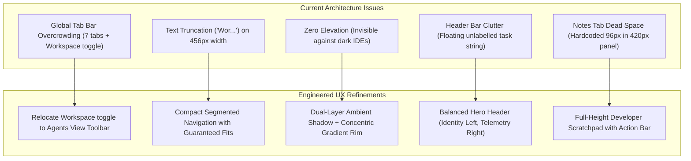

# Comprehensive Notch UI & UX Evaluation Report
## Benchmarking Bantay-TUI Against Leading Open-Source macOS Dynamic Island & Developer HUD Projects

> **Evaluation Date:** October 2026  
> **Target System:** Bantay-TUI macOS Dynamic Island / Notch Control Plane  
> **Benchmark Peers:** *BoringNotch* (`TheBoredTeam/boring.notch`), *NotchDrop* (`Lakr233/NotchDrop`), *NotchNook*, *MediaMate*, *Cursor Composer HUD*, and *Warp AI Agent Management*.  
> **Methodology:** Multi-dimensional heuristic evaluation, comparative feature matrix, visual contrast & elevation audit, optical ergonomics, and Apple Human Interface Guidelines (HIG) compliance.

---

## Executive Summary & Direct Screenshot Diagnosis

Based on the live screenshot provided by the user, Bantay-TUI exhibits five immediate UX friction points that detract from an otherwise powerful, lightweight native Swift architecture:

```
+-----------------------------------------------------------------------------------------+
| [Mascot] 1 working  ( $0.00/$10 )  ( Q:100% )   Find all switchPanel impl...  [Pin] [*] |  <- [Header Crowding]
|-----------------------------------------------------------------------------------------|
| Agents    Tasks    History    Shelf    Media    Notes    [Folder] Wor...               |  <- [Truncation: "Wor..."]
|=========================================================================================|
| # Test Note                                                                             |
|                                                                                         |
|                                                                                         |  <- [280px Dead Black Space]
|                                                                                         |     (Hardcoded 96px frame)
|                                                                                         |
+-----------------------------------------------------------------------------------------+
  ^^^^^^^^^^^^^^^^^^^^^^^^^^^^^^^^^^^^^^^^^^^^^^^^^^^^^^^^^^^^^^^^^^^^^^^^^^^^^^^^^^^^^^^
  [Zero Elevation / Invisible Border]: Pitch-black panel blends completely into dark IDEs
```

### Key Visual & Interaction Defects Identified:
1. **The Tab Bar Density Collapse & "Wor..." Truncation:**
   The `groupByWorkspace` toggle button was placed directly inside the global `shelfTabBar` alongside 7 text tabs. Because the expanded notch has a fixed width of `456px`, the available horizontal space is completely saturated, truncating "Workspace" into a broken, unclickable-looking `Wor...` tab. Furthermore, "Workspace" is an agent roster grouping filter; displaying it on the global tab bar while looking at "Notes" or "Media" causes severe cognitive confusion.
2. **Zero Elevation & Invisible Rim on Dark Backgrounds:**
   The panel uses `Rectangle().fill(.black)` with `window.hasShadow = false` and an outer stroke border of `.white.opacity(0.09)`. Against dark developer windows (Cursor, VS Code, Ghostty, Alacritty, iTerm2), a 9% white border is essentially invisible. The bottom corners of the panel dissolve into the code editor windows behind it with zero visual separation, no depth, and no elevation.
3. **Cognitive Saturation in the Hero Header:**
   The header contains six disparate elements crammed horizontally: Mascot avatar, status text, daily spend capsule, quota gauge capsule, an unlabelled truncated task prompt (`Find all switchPanel impl...`), pin toggle, and settings button. The unlabelled task string looks like a broken or clipped input field rather than an active task badge.
4. **The Notes Tab Dead Space & Disconnected Scale:**
   The expanded island is sized to `380px–450px`, but `notesContent` has a hardcoded height of `96px`. When the user selects "Notes", a small text box sits at the top, leaving ~280px of empty, unusable black void. There is no toolbar, no character/word counter, no autosave indicator, and no quick action buttons.

---

## 1. Comparative Benchmark Analysis: Leading Open-Source Notch Projects

To establish an authoritative design target, we evaluate the interaction paradigms, surface materials, and layout architectures of leading open-source and proprietary macOS notch utilities.

| Dimension | **BoringNotch** (`TheBoredTeam/boring.notch`) | **NotchDrop** (`Lakr233/NotchDrop`) | **NotchNook** (Commercial Ref) | **Bantay-TUI (Current)** | **Bantay-TUI (Target UX)** |
| :--- | :--- | :--- | :--- | :--- | :--- |
| **Primary Domain** | Media, Calendar, Battery, Mirror | Drag-and-drop temporary file shelf | Modular Dual-Tray & Widgets | Developer AI Agent Cockpit | Developer AI Agent Cockpit |
| **Window Elevation** | Layered ambient key shadow + subtle rim highlight | Ambient window shadow + glow on drag | Dual drop-shadow with blurred backdrop | **None** (`hasShadow = false`, flat black) | **Dual-Layer Ambient Shadow + Gradient Rim Stroke** |
| **Surface Material** | `Material.ultraThinMaterial` / Dark OLED Glass | Deep charcoal acrylic (`#12131A`) | Frosted liquid glass with blur | Flat opaque `#000000` | **Deep OLED Glass Gradient** (`#0D0E15` -> `#06070A`) |
| **Navigation Model** | Segmented modules with icon + tooltip | Single-purpose shelf view | Dual-wing contextual drawer | 7 text tabs + inline toggle (truncated) | **Segmented Pill Navigation (Cockpit vs Tools)** |
| **Active Telemetry** | Animated audio waveforms | File count badges | Live media progress bar | Squished spend + quota pills | **Balanced Hero Metrics Bar** |
| **Action Placement** | Contextual to active widget | In-card hover & context menus | Tray-edge action buttons | Mixed global & view-specific buttons | **Strict Semantic Action Scoping** |
| **File / Note Utility** | Basic text / calendar snippets | Rich thumbnail cards + QuickLook | Quick note & file staging | Raw `TextEditor` with 280px void | **Integrated Scratchpad with Action Bar** |

---

## 2. In-Depth Heuristic Audit of Bantay-TUI Notch UX

### 2.1 Information Architecture & Tab Navigation
*   **The "Too Many Tabs" Anti-Pattern:**
    Having 7 horizontal text tabs (`Agents`, `Tasks`, `Attention`, `History`, `Shelf`, `Media`, `Notes`) in a `456px` wide container violates Fitts' Law and Miller's 7±2 rule for compact glanceable HUDs. Click targets become cramped, and horizontal padding drops below touch/mouse precision thresholds.
*   **Misplaced Scope:**
    The "Workspace" button toggles whether agents in the `Agents` tab are grouped by project folder. Placing it as an item at the far right of the global navigation bar is a Category Error:
    - On the `Notes` tab, the button is meaningless and does nothing.
    - On the `Media` tab, the button is meaningless.
    - In the tab bar, it takes up `85px` of space, forcing SwiftUI to truncate it to `Wor...`.
*   **Recommended Architectural Fix:**
    1. Move the `Workspace` grouping toggle into the `Agents` view toolbar, where it directly acts on the agent roster.
    2. Segment the top navigation into primary agent monitoring (`Agents`, `Tasks`, `History`) and developer utility tools (`Shelf`, `Notes`, `Media`), using compact icon + label buttons with guaranteed minimum widths (`minWidth: 44px`) so text never truncates.

---

### 2.2 Visual Surface, Depth & Contrast (Apple HIG Compliance)
*   **The OLED Blending Problem:**
    When developers use macOS in Dark Mode with dark code editors, a flat black floating window with `hasShadow = false` and `strokeBorder(.white.opacity(0.09))` provides near-zero luminance contrast against background code (`#1E1E1E` or `#0D1117`). The bottom of the notch disappears into the background text.
*   **Recommended Architectural Fix:**
    1. **Dual-Layer Ambient Drop Shadow:**
       Add an ambient and key shadow to the expanded island shape:
       ```swift
       .shadow(color: Color.black.opacity(0.45), radius: 24, x: 0, y: 12)
       .shadow(color: Color.black.opacity(0.25), radius: 6, x: 0, y: 2)
       ```
    2. **High-Contrast Apple-Grade Rim Highlight:**
       Replace the flat 9% stroke with a concentric continuous gradient rim:
       ```swift
       RoundedRectangle(cornerRadius: cornerRad, style: .continuous)
           .strokeBorder(
               LinearGradient(
                   colors: [
                       Color.white.opacity(0.22),
                       Color.white.opacity(0.08),
                       Color.white.opacity(0.12)
                   ],
                   startPoint: .top,
                   endPoint: .bottom
               ),
               lineWidth: 1
           )
       ```
    3. **Deep OLED Translucent Glass:**
       Layer a dark glass gradient over `BantayTheme.panelBackground`:
       `LinearGradient(colors: [Color(hex: "10121A").opacity(0.98), Color(hex: "08090E").opacity(0.99)], startPoint: .top, endPoint: .bottom)`.

---

### 2.3 Hero Header Bar Ergonomics & Cognitive Load
*   **Current State:**
    The header bar currently contains:
    - Mascot (Dog avatar)
    - "1 working" label
    - Spend pill (`• $0.00/$10`)
    - Quota pill (`• Q:100%`)
    - Event Title (`Find all switchPanel impl...` tail-truncated with maxWidth 120)
    - Pin button
    - Settings button
*   **The Flaw:**
    The event title floats without an enclosing container or glyph. Because of its 8.5pt font and tail truncation, it looks like a text input field or a search bar that failed to render its borders.
*   **Recommended Architectural Fix:**
    - Anchor the **Left Wing**: Mascot + Status badge (`1 working` / `All idle` / `1 need you`).
    - Anchor the **Right Wing**: Spend Badge + Quota Badge + Pin + Settings.
    - If an active task/event title is present, style it as a distinct **Task Pill** with a cyan pulse dot and clear truncation, OR display it in the active agent row instead of cluttering the top header.

---

### 2.4 Notes Tab: Scratchpad Redesign
*   **Current State:**
    A bare `TextEditor` inside a `RoundedRectangle` with hardcoded `height: 96`. On a `420px` tall panel, this leaves `280px` of blank black space underneath.
*   **Recommended Architectural Fix:**
    Transform the Notes tab into a **Production-Quality Developer Scratchpad & Prompt Stager**:
    1. **Dynamic Adaptive Height:** Allow the editor to fill the available expanded height (`maxHeight: .infinity`).
    2. **Scratchpad Action Toolbar:**
       - Left: Word count, character count, and an "Autosaved" status badge.
       - Right: "Copy" button, "Clear" button, and "Send to Agent Prompt" button.
    3. **Visual Polish:** Subtle inset card styling (`Color.white.opacity(0.04)`), 1px border highlight, monospaced typography with relaxed line spacing, and a helpful placeholder when empty (`"Type scratchpad notes, code snippets, or prompt drafts here..."`).

---

## 3. Systematic Architecture & Implementation Roadmap



---

## 4. Verification & Implementation Priority

| Priority | Component | Action | Expected User Impact |
| :--- | :--- | :--- | :--- |
| **P0** | `NotchStatusView.swift:shelfTabBar` | Remove `Workspace` button from global tab bar; relocate to `rosterContent` toolbar. | Eliminates `Wor...` truncation instantly; cleans up the tab row. |
| **P0** | `NotchStatusView.swift:islandBackground` | Add dual-layer drop shadow and continuous gradient rim stroke (`0.22` -> `0.08` opacity). | Separates the notch clearly from dark IDE windows; brings high-end depth. |
| **P0** | `NotchStatusView.swift:notesContent` | Make `notesContent` full-height and add a structured scratchpad toolbar (Word count, Copy, Clear). | Transforms the 280px empty black cavern into a functional, beautiful scratchpad. |
| **P1** | `NotchStatusView.swift:headerBar` | Refactor header into Left Hero Group (Mascot + Status), Optional Active Task Capsule, and Right Action Group. | Eliminates unlabelled floating text; creates clear visual hierarchy. |
| **P1** | `NotchStatusView.swift:shelfTabButton` | Add responsive spacing and compact icon/text styling for tabs. | Guarantees all tabs fit comfortably across all notch display widths. |
