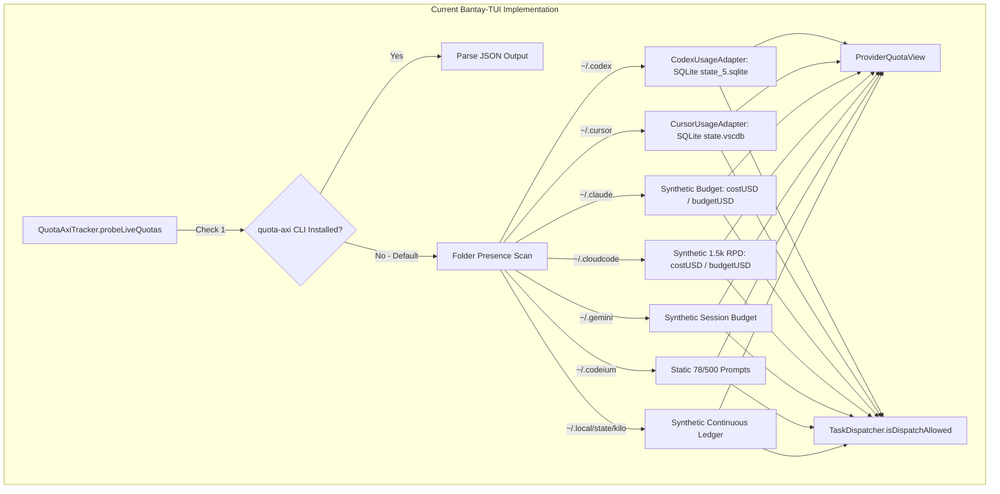
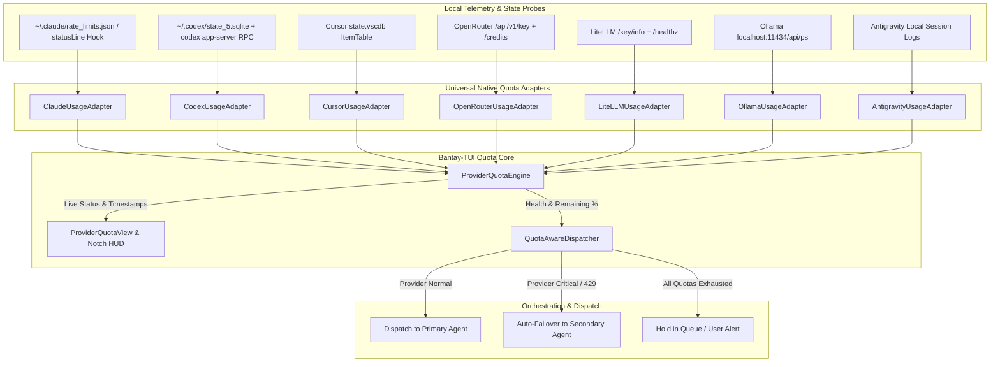

# Comprehensive Quota Detection & BYOK Orchestration Gap Assessment

**Document**: Research & Architecture Assessment  
**Project**: Bantay-TUI (`8-BitRhyon/bantay-tui`)  
**Topic**: Quota Detection, Rate Limiting, BYOK Consolidation, and Multi-Vendor Agent Orchestration  
**Date**: October 2026  

---

## 1. Executive Summary

As developers increasingly run diverse AI coding agents (Claude Code, OpenAI Codex, Cursor, Antigravity, OpenCode, Windsurf, Copilot, Ollama, etc.), they face a fragmented, opaque landscape of rate limits, rolling quota windows, prepaid credit burn, and token budgets.

Bantay-TUI currently features a foundation for quota tracking via `QuotaAxiTracker.swift`, `UniversalQuotaAdapters.swift`, and `ProviderQuotaView.swift`. However, a deep comparative assessment against state-of-the-art open-source projects (**CodexBar**, **T3 Code**, **Capy**, **LiteLLM**, **Claude-Swap**, **OpenRouter**, **Aider**, and **Cline**) reveals that Bantay-TUI suffers from **ten major architectural gaps**:
1. **The Synthetic Blindspot**: For most providers (Claude, Cloud Code, Windsurf, Kilo, Antigravity), Bantay-TUI estimates remaining quotas using a synthetic ratio `(budget - cost) / budget` instead of reading real provider telemetry.
2. **Missing Claude Code Real-Time Hook Ingestion**: Claude Code pipes real-time `five_hour` and `seven_day` `used_percentage` and Unix `resets_at` timestamps into `statusLine` commands (`~/.claude/settings.json`), which Bantay-TUI does not capture.
3. **Hard Dependency on Non-Existent `quota-axi` CLI**: The system probes for `quota-axi`, which is not installed on standard macOS machines, instantly degrading to synthetic fallbacks.
4. **No OpenRouter or AI Gateway Integration**: OpenRouter's `/api/v1/key` and `/api/v1/credits` endpoints provide exact token allowances and dollar balances across 100+ models, but are unprobed.
5. **No Local Credential / Session Discovery**: Unlike CodexBar, which inspects Keychain, local cookies, and CLI auth states without storing passwords, Bantay-TUI does not auto-discover authenticated accounts.
6. **No Multi-Account Rotation or Pooling**: Developers running multiple Claude Max or OpenAI accounts cannot monitor or auto-rotate between them (as enabled by `claude-swap` and T3 Code).
7. **Flat Cost Modeling Ignoring Prompt Caching**: Cost calculations use flat token rates (e.g. $3 / 1M tokens), ignoring Anthropic's 90% discount on cache reads and cache write premiums.
8. **Static Reset Hints vs. Dynamic Live Countdowns**: Reset indicators show static text (`"5h rolling window"`, `"Midnight UTC"`) rather than dynamic countdown timers (`"Resets in 1h 24m"`).
9. **Disconnection from Task Orchestration**: `TaskDispatcher.swift` enforces a binary cost ceiling, but lacks intelligent failover routing (e.g., auto-rerouting to Codex when Claude hits 95% quota or returns 429).
10. **Zero-Cost Local Provider Exclusion**: Local models (Ollama, LM Studio) have unlimited token quotas, but lack presence and VRAM/compute tracking in the HUD.

---

## 2. Competitive & Ecosystem Benchmarking

| Platform / Project | Primary Architecture | Quota & Rate Limit Detection Mechanisms | BYOK & Auth Handling | Orchestration & Failover Strategy |
| :--- | :--- | :--- | :--- | :--- |
| **CodexBar** (`steipete/CodexBar`) | Native macOS menu bar (Swift) & CLI monitoring 87+ AI providers. | Multi-tier probing: CLI RPC (`account/rateLimits/read`), local SQLite databases (`state_5.sqlite`, `state.vscdb`), LSP/HTTP endpoints, web session cookies, and API keys. | Zero-password storage: reuses local CLI logins, browser cookies, and macOS Keychain. | Monitoring-focused; provides rich telemetry for external automation and widgets. |
| **T3 Code** (`pingdotgg/t3code`) | Desktop GUI agent harness (Electron / TypeScript) consolidating CLI coding agents. | Reads real-time usage windows per provider; dedicated "Limits" tab displaying quota percentage and reset timers. | Bring Your Own Subscription (BYOS): bridges local CLI logins (Claude, Codex, Cursor, OpenCode). | Multi-account management; auto-selects accounts based on remaining quota; handles git worktrees and diffs. |
| **Capy & Capy-CLI** (`PlawIO/capy-cli`, `capy.ai`) | Agent orchestrator with quality gates and parallel cloud VMs. | Tracks project credits, VM compute time, and token burn; pauses new tasks when budget cap is hit while letting running work finish. | BYOK for enterprise; local CLI with zero dependencies using `bun` and `gh`. | "Captain + Build" agent decomposition; parallel execution; Trigger.dev long-running task orchestration. |
| **LiteLLM / LiteLLM Proxy** | Open-source AI Gateway & routing proxy (Python). | Enforces Requests Per Minute (RPM) and Tokens Per Minute (TPM); tracks `x-ratelimit-*` response headers; monitors saturation thresholds. | Centralized BYOK; virtual keys with custom spending caps; database-backed budgets. | Budget fallbacks per virtual key; automatic failover on 429 errors with cooldown quarantine periods. |
| **Claude-Swap** (`realiti4/claude-swap`) | CLI multi-account manager for Claude Code. | Monitors `rate_limits.five_hour.used_percentage` and `resets_at` timestamps from Claude session state. | Manages credential swapping in `~/.claude/` without manual re-login. | `--strategy best` (chooses account with most quota); `--strategy next-available` (skips rate-limited accounts). |
| **OpenRouter** | Multi-vendor model aggregator and API router. | Exposes `GET /api/v1/key` (limit, limit_remaining, limit_reset) and `GET /api/v1/credits`; returns `X-RateLimit-*` on 429. | Unified API key managing access to 100+ models. | Automatic fallback routing chains defined in request parameters; load balancing across model providers. |
| **Aider** | Terminal-based pair programming CLI (Python). | Calculates real-time session cost and token mix (input, output, cache read, cache write); `/cost` and `/context` commands. | BYOK via environment variables (`ANTHROPIC_API_KEY`, `OPENAI_API_KEY`, etc.). | Prompt caching to prevent quadratic token snowballing; hybrid model architecture (expensive model for edits, cheap model for planning). |
| **Cline / Roo Code** | VS Code autonomous coding extension (TypeScript). | Tracks real-time context window usage percentage, token counts per turn, and running dollar cost; supports auto-truncation. | BYOK across Anthropic, OpenAI, OpenRouter, AWS Bedrock, GCP Vertex, Ollama. | Context condensing / summarization when context exceeds 50%; manual request delay throttling to prevent 429s. |

---

## 3. Deep Audit of Bantay-TUI's Current Quota Architecture



### 3.1 Strengths of Current Implementation
1. **Zero-Locking SQLite Telemetry**:
   `UniversalQuotaAdapters.swift` executes SQLite queries using `file://...?immutable=1&mode=ro` with `SQLITE_OPEN_READONLY | SQLITE_OPEN_URI`. This ensures zero locking or database contention while Codex or Cursor are actively writing to their SQLite databases.
2. **Deep Local Inspection for Codex and Cursor**:
   - `CodexUsageAdapter` accurately queries the `threads` table for total tokens, today's tokens (`updated_at_ms >= startOfDayMs`), active thread count, and latest model.
   - `CursorUsageAdapter` inspects `ItemTable` in `state.vscdb` for `aiCodeTracking.dailyStats` (suggested/accepted lines) and `composer.composerHeaders` (context usage %, lines added/removed).
3. **Burn Rate TPM & Runway Forecasting**:
   `QuotaAxiTracker.forecastHoursRemaining` computes runway hours based on token burn rate per minute (`burnRateTPM`), and flags high velocity alerts when TPM $\ge 2500$.
4. **Structured Micro-Dashboard**:
   `ProviderQuotaView.swift` provides a clean SwiftUI visual component with status color thresholds (`isWarning` $\le 20\%$, `isCritical` $\le 5\%$), and progress bars.

### 3.2 Critical Weaknesses & Blindspots
1. **The Claude Code Blindspot**:
   Despite Claude Code being the most common CLI coding agent, Bantay-TUI calculates its remaining quota as `basePercent = ((budget - costUSD) / budget) * 100.0`. If a user has a $10 budget in Bantay-TUI and has spent $2, Bantay-TUI displays 80% remaining, even if the user has reached 99% of their actual Anthropic 5-hour rolling limit!
2. **Hard External Dependency on `quota-axi`**:
   `QuotaAxiTracker` checks `/opt/homebrew/bin/quota-axi`, `/usr/local/bin/quota-axi`, etc. When missing, 5 out of 7 providers fall back to synthetic approximations.
3. **Static Reset Hints**:
   Reset hints are hardcoded strings (`"5h rolling window"`, `"Midnight UTC"`, `"Renews 1st of month"`). Users cannot see whether their window resets in 10 minutes or 4 hours.
4. **No Orchestration Feedback Loop**:
   When `isCritical` is reached on a provider, `TaskDispatcher` does nothing to divert tasks to other capable providers.

---

## 4. The 10 Major Architectural Gaps in Detail

### Gap 1: Synthetic Quotas vs. Real Telemetry
- **Issue**: Synthetic quotas based on a daily dollar budget create a false sense of security. A developer might have plenty of dollar budget left while being completely blocked by provider-side rolling windows or token buckets.
- **State of the Art**: CodexBar and T3 Code inspect actual provider APIs, session tokens, or local telemetry databases.
- **Solution for Bantay-TUI**: Replace synthetic calculations with dedicated native telemetry adapters for each major provider.

### Gap 2: Missing Claude Code Live StatusLine Ingestion
- **Issue**: Claude Code v2.1.80+ natively supports piping real-time rate limit data into a configured command:
  ```json
  {
    "rate_limits": {
      "five_hour": { "used_percentage": 42.3, "resets_at": 1774036800 },
      "seven_day": { "used_percentage": 85.7, "resets_at": 1774580400 }
    }
  }
  ```
- **State of the Art**: `claude-swap` and CodexBar use this payload to display exact percentages and minute-accurate reset countdowns.
- **Solution for Bantay-TUI**: Provide a built-in helper script (or local HTTP hook to `EventIngestServer`) that Claude Code calls via `~/.claude/settings.json`, saving the latest telemetry into `~/.claude/rate_limits.json` or Bantay's state store.

### Gap 3: Missing OpenRouter & AI Gateway Integration
- **Issue**: OpenRouter and LiteLLM are the primary BYOK aggregators. OpenRouter provides official endpoints:
  - `GET https://openrouter.ai/api/v1/key` (returns `limit`, `limit_remaining`, `limit_reset`, `usage`).
  - `GET https://openrouter.ai/api/v1/credits` (returns total credits, balance, and spend).
- **State of the Art**: Cline, Aider, and CodexBar natively poll these endpoints using the user's API key.
- **Solution for Bantay-TUI**: Add `OpenRouterUsageAdapter` that queries `openrouter.ai/api/v1/key` when `OPENROUTER_API_KEY` is present.

### Gap 4: Local Credential Discovery Without Password Storage
- **Issue**: Users must manually configure or guess provider states.
- **State of the Art**: CodexBar inspects existing CLI configs:
  - Claude: `~/.claude/` session tokens and OAuth.
  - Codex: `~/.codex/config.toml` and CLI RPC `codex ... app-server` (`account/rateLimits/read`).
  - Gemini: `~/.gemini/` or Google ADC (`gcloud auth print-access-token`).
  - OpenCode: `~/.config/opencode/` settings.
- **Solution for Bantay-TUI**: Add zero-password local credential discovery to inspect existing CLI authentication files and environment variables.

### Gap 5: Multi-Account Pooling & Rotation
- **Issue**: Power developers often maintain multiple Pro or Max accounts (personal, employer, client). Bantay-TUI only models a single instance of each provider.
- **State of the Art**: `claude-swap` maintains an account directory with rotation strategies (`best`, `next-available`). T3 Code manages multiple accounts across environments.
- **Solution for Bantay-TUI**: Allow `ProviderQuota` to identify multiple account slots (e.g. `claude:personal`, `claude:work`), displaying independent quota cards.

### Gap 6: Prompt Caching Economics
- **Issue**: Modern coding agents use prompt caching heavily. For Claude 3.5 Sonnet / Opus, prompt cache read is $0.30/1M tokens (90% discount) vs $3.00/1M standard input tokens, and cache write is $3.75/1M tokens. Flat pricing distorts estimated cost by up to 10x.
- **State of the Art**: Aider and Langfuse separate tokens into `input`, `output`, `cache_read`, and `cache_write` to calculate exact spend.
- **Solution for Bantay-TUI**: Enhance `UsageSnapshot` and telemetry adapters to record cache hits and compute cost with tiered pricing formulas.

### Gap 7: Dynamic Live Reset Countdowns
- **Issue**: Static reset strings like `"24h"` or `"5h rolling window"` provide no urgency or schedule awareness.
- **State of the Art**: CodexBar and T3 Code parse Unix `resets_at` timestamps into live countdowns (`"1h 12m remaining"`, `"Resets at 2:15 PM"`).
- **Solution for Bantay-TUI**: Add `resetsAt: Date?` to `ProviderQuota`, and format it dynamically in `ProviderQuotaView` and `NotchStatusView`.

### Gap 8: Disconnect Between Quota Detection and Task Orchestration
- **Issue**: `TaskDispatcher.swift` only checks `AgentEventManager.shared.usage.costUSD < budget`. If Claude Code is at 99% of its 5-hour limit, dispatching a task to Claude will immediately fail with a 429 error.
- **State of the Art**: LiteLLM (dynamic budget fallbacks), Capy (routing to available workers), and `claude-swap` (auto-switching to unblocked accounts).
- **Solution for Bantay-TUI**: Introduce **Quota-Aware Task Dispatching**:
  - If target provider is `isCritical` ($\le 5\%$) or in cooldown from a 429, suggest or automatically route to an unblocked fallback provider (e.g. Claude $\rightarrow$ Codex $\rightarrow$ Antigravity).

### Gap 9: Zero-Cost Local LLMs (Ollama / LocalAI)
- **Issue**: Developers using Ollama for local offline coding have infinite quota, but Bantay-TUI does not track Ollama model availability, active context, or local inference status.
- **State of the Art**: CodexBar monitors Ollama loaded models and memory usage (`/api/ps` and `/api/tags`).
- **Solution for Bantay-TUI**: Add `OllamaUsageAdapter` checking `http://localhost:11434/api/ps` to show local model inference as an unlimited-quota provider card.

### Gap 10: Provider Degraded Health & Outage Detection
- **Issue**: When a provider's API is down (e.g. Anthropic or OpenAI API incident), users mistakenly assume their local app or agent is broken.
- **State of the Art**: CodexBar integrates Statuspage.io links and indicators for OpenAI, Anthropic, and GitHub.
- **Solution for Bantay-TUI**: Add provider status checks to display an alert banner when an upstream provider has an active incident.

---

## 5. Architectural Blueprint for Bantay-TUI



### 5.1 Enhanced `ProviderQuota` Model
```swift
public struct ProviderQuota: Identifiable, Codable, Equatable, Sendable {
    public var id: String
    public var provider: String
    public var accountLabel: String?
    public var remainingPercent: Double
    public var resetsAt: Date?
    public var resetHint: String
    public var tier: String
    public var usedDisplay: String
    public var totalDisplay: String
    public var burnRateTPM: Double
    public var hoursRemaining: Double?
    public var isCachedTokensSupported: Bool
    public var promptTokens: Int
    public var completionTokens: Int
    public var cachedTokens: Int
    public var isWarning: Bool { remainingPercent <= 20.0 }
    public var isCritical: Bool { remainingPercent <= 5.0 }
    public var isCooldown: Bool
    public var cooldownUntil: Date?
}
```

### 5.2 Claude Code Live Ingest Adapter
Claude Code can be configured to write its telemetry directly to a local JSON file or send an HTTP POST to Bantay-TUI's `EventIngestServer`:
```bash
# ~/.claude/settings.json
{
  "statusLine": {
    "type": "command",
    "command": "curl -s -X POST http://127.0.0.1:41420/telemetry/claude -d @-"
  }
}
```
When `EventIngestServer` receives the payload:
```json
{
  "rate_limits": {
    "five_hour": { "used_percentage": 42.3, "resets_at": 1774036800 },
    "seven_day": { "used_percentage": 85.7, "resets_at": 1774580400 }
  }
}
```
It immediately updates `ClaudeUsageAdapter.liveTelemetry`, giving Bantay-TUI **100% exact real-time 5-hour and 7-day quota tracking with live countdowns**.

---

## 6. Implementation Roadmap

### Phase 1: High-Fidelity Local Telemetry Adapters
- Implement `ClaudeUsageAdapter` with `statusLine` file/hook reader.
- Enhance `CodexUsageAdapter` with prompt cache token distinctions.
- Implement `OpenRouterUsageAdapter` querying `/api/v1/key` and `/api/v1/credits`.
- Eliminate the external `quota-axi` dependency by making native Swift adapters the primary source of truth.

### Phase 2: Live Reset Timers & UI Polish
- Update `ProviderQuotaView.swift` to render dynamic countdowns (`"Resets in 1h 24m"`) based on `resetsAt`.
- Integrate live quota indicators into `NotchStatusView.swift` expanded shelf.
- Add sound effects and mascot animations for quota warning / critical transitions.

### Phase 3: Quota-Aware Task Orchestration
- Update `TaskDispatcher.swift` with fallback routing chains (e.g. `claude` $\rightarrow$ `codex` $\rightarrow$ `antigravity`).
- Detect 429 errors from transcript scanning (`AgentDetector.swift`), immediately putting the affected provider into a cooldown state and triggering automated failover.
- Allow users to configure priority provider chains in `SettingsView.swift`.

### Phase 4: Multi-Account Management
- Support account aliases (e.g. `claude:personal`, `claude:work`) in `ProviderQuotaEngine`.
- Enable one-click account switching in `NotchStatusView` context menus.
